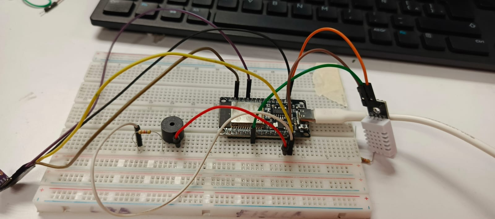
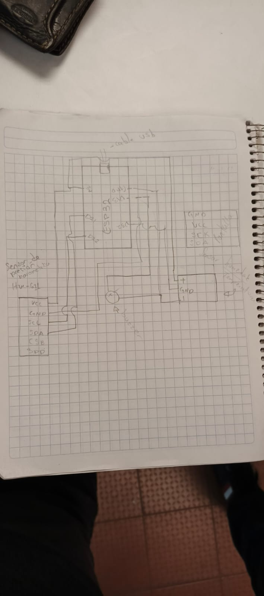
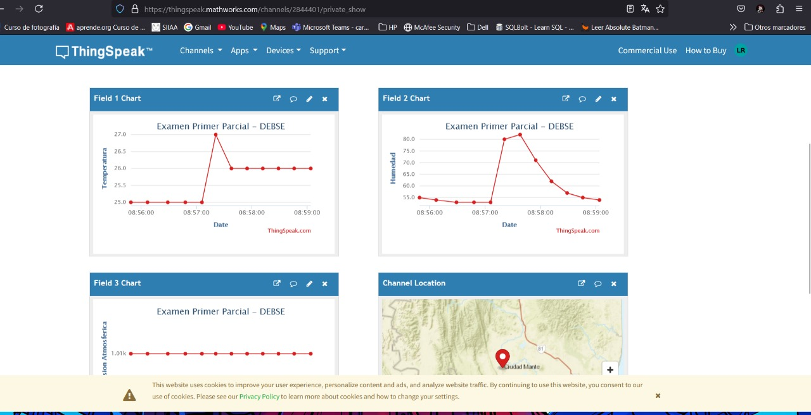

# Monitor de Sensores con ESP32 y ThingSpeak
Este proyecto utiliza un ESP32 para leer datos de temperatura, humedad y presión desde sensores DHT22 y BMP280. Los datos recopilados se envían a ThingSpeak para su monitoreo en la nube. Además, se incluye un sistema de alarma con un buzzer que se activa si los valores superan ciertos umbrales.

## Características del Proyecto
- Lectura de temperatura y humedad con el sensor **DHT22**.
- Lectura de temperatura, presión y altitud con el sensor **BMP280**.
- Conexión a WiFi y envío de datos a **ThingSpeak**.
- Alarma sonora mediante un **buzzer** cuando los valores exceden los umbrales definidos.
- Configuración de credenciales WiFi y API Key a través de un archivo de configuración `secrets.h`.

## Hardware Necesario
- **ESP32**
- **Sensor DHT22**
- **Sensor BMP280**
- **Buzzer**
- **Cables y protoboard**

## Librerías Requeridas
Para compilar y ejecutar el código correctamente, es necesario instalar las siguientes librerías en el IDE de Arduino:

- `WiFi.h`
- `ThingSpeak.h`
- `DHT.h`
- `Wire.h`
- `Adafruit_Sensor.h`
- `Adafruit_BMP280.h`

## Configuración del Código
1. Clonar o descargar el repositorio.
2. Agregar un archivo `secrets.h` con las credenciales de la red y la API Key de ThingSpeak:
   ```cpp
   #define SECRET_SSID "TuRedWiFi"
   #define SECRET_PASS "TuContraseña"
   #define SECRET_CH_ID TuChannelID
   #define SECRET_WRITE_APIKEY "TuAPIKey"
   ```
3. Compilar y cargar el código en el ESP32 utilizando el IDE de Arduino.

## Funcionamiento
1. El ESP32 se conecta a la red WiFi configurada.
2. Se inicializan los sensores DHT22 y BMP280.
3. Se leen y muestran los valores en el monitor serie.
4. Los datos se envían a **ThingSpeak** cada cierto tiempo.
5. Si la temperatura supera los **27°C** o la humedad los **60%**, el buzzer se activa como alerta.

## Evidencias del Proyecto
A continuación, se presentan algunas evidencias del desarrollo del proyecto:

### 📷 Imágenes
- 📌 **Circuito utilizado**:  
  
- 📌 **Diagrama de conexión**:  
  
- 📌 **Evidencia en la plataforma**:  
  

### 📄 Archivos de Código y Explicación
- 🔹 **Código del proyecto**: [`codigo.ino`](codigo.ino)
- 🔹 **Explicación del funcionamiento**: [`explicacion.txt`](explicacion.txt)

### 🎥 Videos de Funcionamiento
- 🎬 [Video 1](video1.mp4)
- 🎬 [Video 2](video2.mp4)
